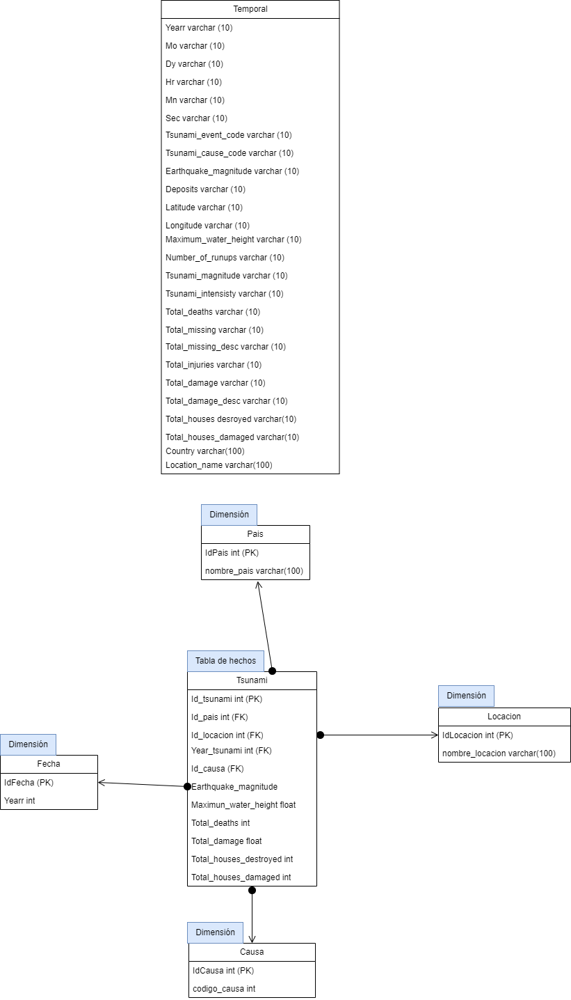

# Laboratorio de Seminario de Sistemas 2

## Estudiante

| Nombre                       | Carnet    |
| ---------------------------- | --------- |
| César André Ramírez Dávila   | 202010816 |

## Explicación del modelo

El modelo elegido para esta práctica fue el modelo Estrella, este es el más sencillo de implementar, se puede analizar los datos de manera flexible, también con el fin de optimizar las consultas realizadas.

### Tablas dimensiones

Las tablas dimensiones para este caso son las siguiente:

<ul>
    <li>País : Contiene información de que país ocurrió el evento.</li>
    <li>Fecha: Contiene la relación con el año del susceso.</li>
    <li>Localidad: Contiene información precisa del lugar dónde ocurrió el evento.</li>
    <li>Causa: Contiene detalles sobre la causa, como el código del evento.</li>
</ul>

### Tabla de hechos

La tabla de hechos se nombra Tsunami, esta contiene los datos recopilados del impacto. Estos datos son los comunmente requeridos para un análisis.

