## Proyecto Fase 1

## Laboratorio Seminario de sistemas 2

## Nombre del proyecto : SGFOOD

## Indice

## Tabla de Contenido

### [1. Requisitos del Sistema](#requisitos-del-sistema)

### [2. Fases del proceso ETL](#fases-del-proceso-etl)

### [3. Modelo DataWarehouse](#modelo-datawarehouse)

## Requisitos del Sistema

<table align="center">
   <tr>
      <th align="center">
         :warning: WARNING :warning:
      </th>
   </tr>
   <tr>
      <td align="center">
      
      Estas son las versiones especificas utilizadas para el desarrollo de este proyecto.
   </tr>
   </table>

   |OS|Windows 10|
|:---:|:---:|
|Máquina|Hp ProBook|
|Espacio en Disco | Dependiendo de las extensiones de Visual Studio y la instalación de lo demás | 
|Ram| 8GB |
|SQL Server 2022 Express |[SQL Server](https://www.microsoft.com/en-us/sql-server/sql-server-downloads)|
|Visual Studio 2019|[Visual Studio](https://github.com/FelixKratz/SketchyBar)|
|MySQL 8.0.36|[MySQL](https://dev.mysql.com/downloads/mysql/)|
|Conector Net Mysql|[Net Conector](https://dev.mysql.com/downloads/connector/net/)|

## Fases del proceso ETL

La aplicación de las fases del procesos ETL es de la siguiente manera:

### **Extracción**

Para esta fase lo que se hace es una conexión a la base de datos a nuestras tablas pivotes, que en este caso se nombra Temporal_Compra y Temporal_Venta, en estas tablas se almacena temporalmente la información de los archivos SGFOOD01.comp y SGFOOD01.vent, igualmente para los archivos 02,  esto se realiza mediante un Script Task.

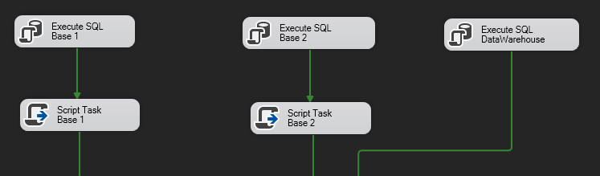

### **Transformación**

Para esta fase se hace mediante una Tarea Flujo de datos.

Dentro de este flujo se toma la información almacenada en las tablas pivote y se procede con la conversión de datos, en esta parte se pasan a los tipos que aceptan las tablas dimensiones.

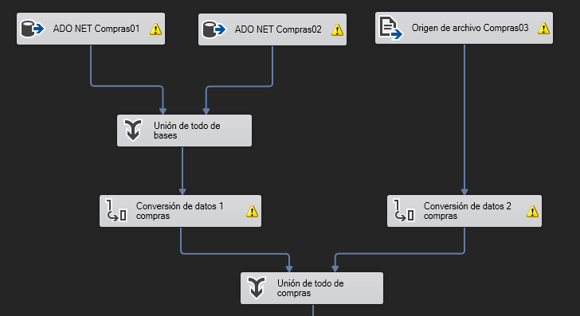

Por último pasa por la columna derivada para omitir los datos que no cumplan con nuestros tipos de datos aceptados y con la división condicional dejamos los datos que si cumplen.

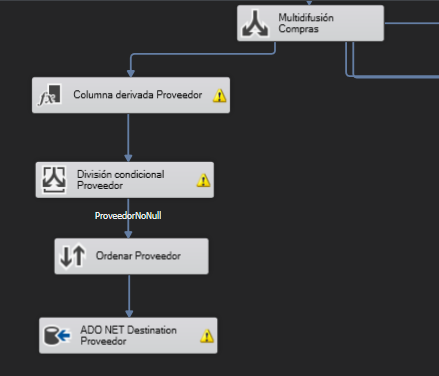

### **Carga**

En esta fase se realiza la carga hacia la tabla de hechos mediante las tablas dimensiones, mediante una Tarea Flujo de datos.

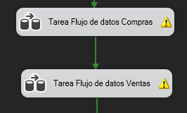

Este es el proceso para cargar los datos a nuestras tablas de hechos, haciendo una comparación con las tablas pivotes, por lo que debemos volver a hacer el flujo de la limpieza de la parte de Transformación.

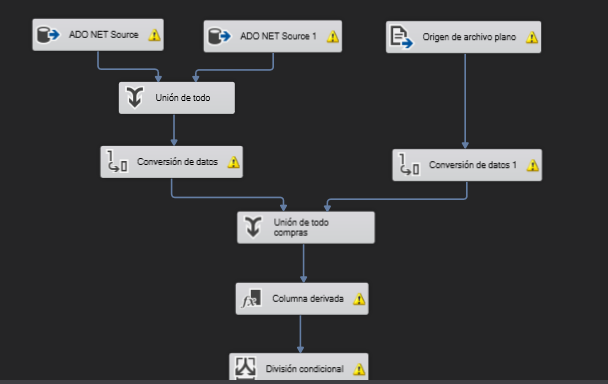

Luego obtenemos los datos de las tablas dimensiones, hacemos un ordenar con el dato a comparar en la tabla pivote y para poder hacer dicha comparación se hace use de Combinación de Mezcla.

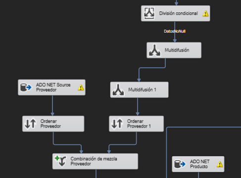

Se tiene que repetir el mismo proceso de ordenar el dato a comparar con la tabla pivote y el uso de Combinación de Mezcla.

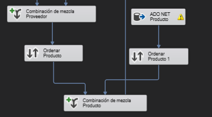

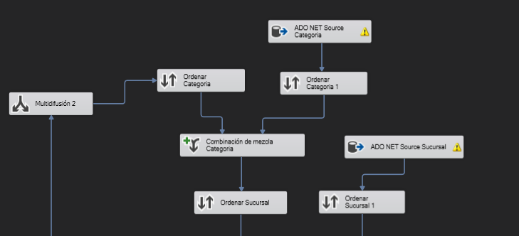

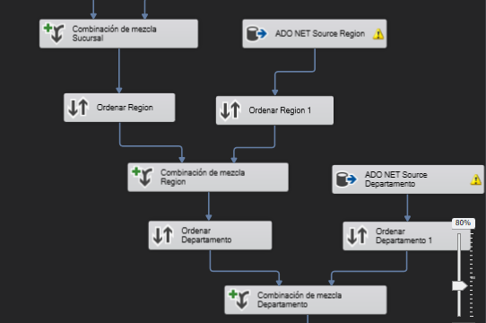

Ya terminado de hacer las comparaciones a la tabla pivote, debemos ordenar todos los datos que necesita nuestra tabla de hechos y eliminamos duplicados, en dado caso existan.

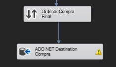

Para mandar los datos a la tabla hechos, se hace uso de un ADO NET Destination, dónde seleccionamos la tabla de Hechos y los datos que necesitamos.

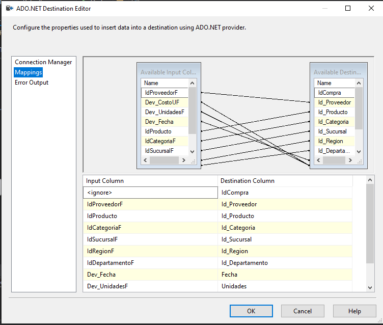

## Modelo DataWarehouse

El modelo que más ajuste tiene a las necesidades del proyecto es: 

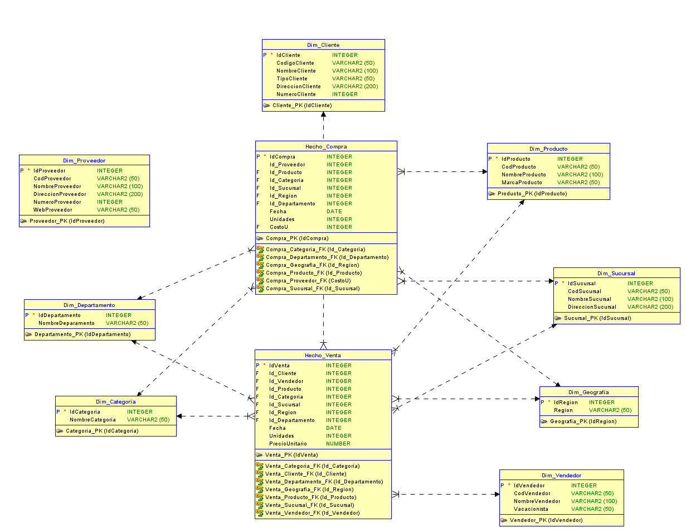

 Este modelo es uno de constelación, debido que la necesidad del proyecto salen dos tablas de hechos, una para compras y otra para ventas, así como en la variedad de dimensiones que pueden estar relacionadas con ambas tablas o ser específicas de una sola. Esta estructura permite agregar fácilmente nuevas fuentes de datos y mantener relaciones complejas entre dimensiones y tablas de hechos. Además, el modelo constelación facilita la optimización de consultas, la escalabilidad del sistema y el mantenimiento a largo plazo.