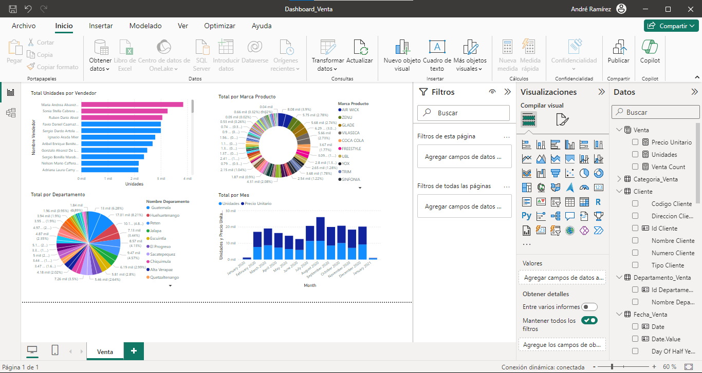

## Proyecto Fase 2

## Laboratorio Seminario de sistemas 2

## Nombre del proyecto : Solución de Business Intelligence

## Indice

## Tabla de Contenido

### [1. Requisitos del Sistema](#requisitos-del-sistema)

### [2. Modelo de DataMart](#modelo-de-datamart)

### [3. Tablero Power BI](#tablero-power-bi)

## Requisitos del Sistema

<table align="center">
   <tr>
      <th align="center">
         :warning: WARNING :warning:
      </th>
   </tr>
   <tr>
      <td align="center">
      
      Estas son las versiones especificas utilizadas para el desarrollo de este proyecto.
   </tr>
   </table>

   |OS|Windows 10|
|:---:|:---:|
|Máquina|Hp ProBook|
|Espacio en Disco | Dependiendo de las extensiones de Visual Studio y la instalación de lo demás | 
|Ram| 8GB |
|SQL Server 2022 Developer |[SQL Server](https://www.microsoft.com/en-us/sql-server/sql-server-downloads)|
|Visual Studio 2019|[Visual Studio](https://github.com/FelixKratz/SketchyBar)|
|SQL SSRS|[SSRS](https://learn.microsoft.com/es-es/sql/reporting-services/install-windows/install-reporting-services?view=sql-server-ver16)|
|Power BI|[Power BI](https://www.microsoft.com/en-us/power-platform/products/power-bi/)|

## Modelo de DataMart

Modelo de DataMart usado para `Compras`

Modelo de DataMart usado para `Ventas`

## Tablero Power BI

Dashboard creado para la información de `Compras`

Dashboard creado para la información de `Ventas`

